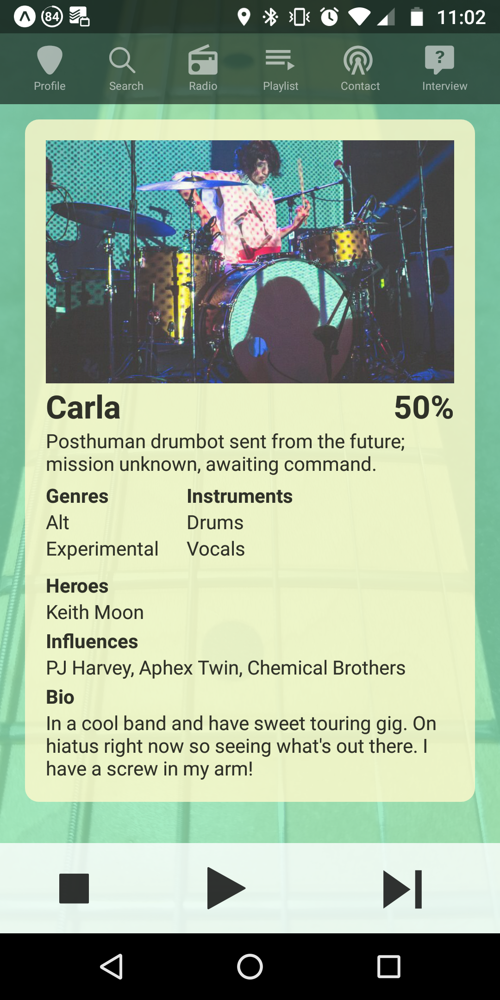

# Bandolier
Bandolier is a mobile matchmaking app seeking to help musicians find their ideal bandmates

## Setup

To install Bandolier, download the APK at AWS DOWNLOAD LINK--------------------- or some IOS thing maybe

Backend is deployed at https://quiet-garden-92157.herokuapp.com

To take it for a spin, you can log in as: 

email: jack@white.com

pw: jack

## How it works

Upon login, the user starts on the "Radio" screen, where they'll see other users and hear their songs. The stop button hides that user, the play button adds them to the Playlist, and the skip button leaves them be for now, moving on to the next. Users can search for others, screening by instruments, genres, and influences, and answer "Interview" questions that will help match them with like-minded potential collaborators. 

